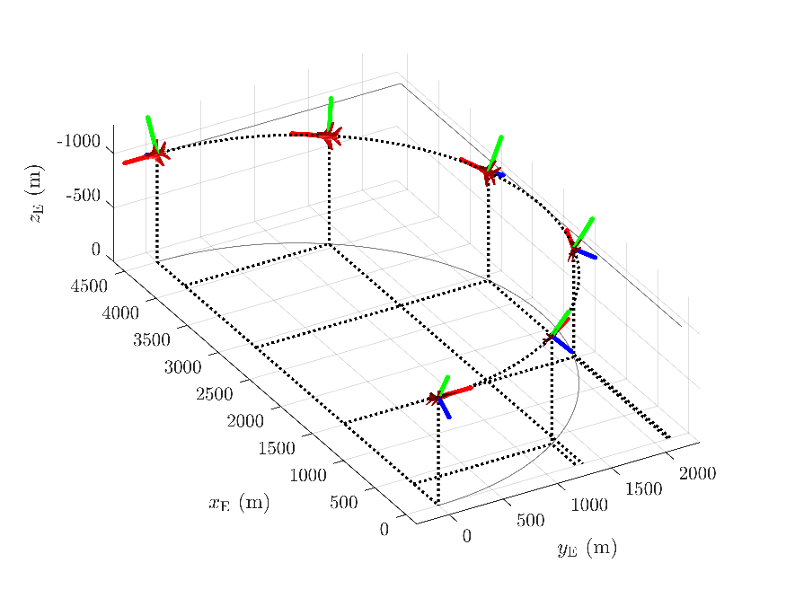

# Flight Simulation using MATLAB and Simulink

This is a collection of MATLAB scripts that allows to simulate aircraft motions, evaluate trim conditions, simulate take-off, and visualize maneuvers.

## Kinematics

Tools to visualize aircraft orientation or maneuver using both formulations: Euler angles or Quaternions.

### Visualize aircraft orientation/motion using Euler angles

See the scripts in the following folders:
- Ex2.1_Orientamento_velivolo_assi_Terra
- Ex2.2-2.3_Componenti_peso_assi_velivolo
- Ex2.4_Orientamenti_successivi_velivolo
- Ex2.5_Integrazione_eqs_cinematiche

### Visualize aircraft orientation/motion using Quaternions

See the scripts in the following folders:
- Ex3.1_Cinematica_looping
- Ex3.2_Traiettoria_looping
- Ex3.3_KinTraj_tonneau
- Ex3.4_KinTraj_lazy8

## Dynamics

### Simulate 6-DoF motion

### Simulate 3-DoF motion

### Find trim (equilibrium) conditions

### Simulate control surfaces

## Stability and linearized dynamics

### Longitudinal dynamics

### Lateral-directional dynamics

## Simulate take-off

### Simulink model
