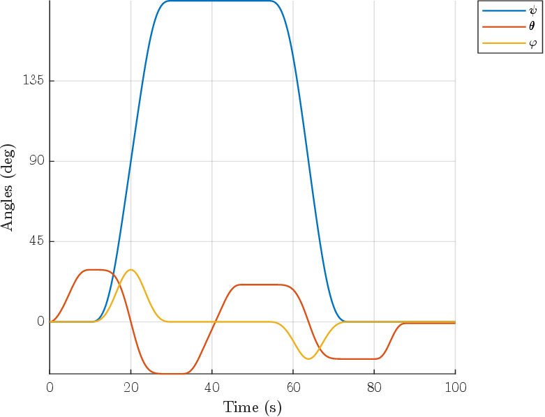

# Flight Simulation using MATLAB and Simulink

This is a collection of MATLAB scripts that allows to simulate aircraft motions, evaluate trim conditions, simulate take-off, and visualize maneuvers.

For more detailed information see the technical Report.pdf file.

## Kinematics

Tools to visualize aircraft orientation or maneuver using both formulations: Euler angles or Quaternions.

### Visualize aircraft orientation/motion using Euler angles

See the scripts in the following folders:
- Ex2.1_Orientamento_velivolo_assi_Terra
- Ex2.2-2.3_Componenti_peso_assi_velivolo
- Ex2.4_Orientamenti_successivi_velivolo
- Ex2.5_Integrazione_eqs_cinematiche

### Visualize aircraft orientation/motion using Quaternions

See the scripts in the following folders:
- Ex3.1_Cinematica_looping
- Ex3.2_Traiettoria_looping
- Ex3.3_KinTraj_tonneau
- Ex3.4_KinTraj_lazy8

## Dynamics

Tools to simulate aircraft motion and evaluate trim conditions.

### Simulate 6-DoF motion

See the scripts in the following folders:
- ex7.2
- ex7.3
- excabrapicchia
- exf18harvthrust

### Simulate 3-DoF motion

See the scripts in the following folders:
- ex3dofsim

### Find trim (equilibrium) conditions

See the scripts in the following folders:
- f18harv_Trim3DOF
- ex3dofTrimLin

### Simulate control surfaces

See the scripts in the following folders:
- ex3doflinstickfree

## Stability and linearized dynamics

### Longitudinal dynamics

### Lateral-directional dynamics

## Simulate take-off

See the MATLAB scripts and the Simulink models inside the folder TakeOff_ATR42.

### Simulink model

The main plant:

For subsystems see the folder or the pdf report.
